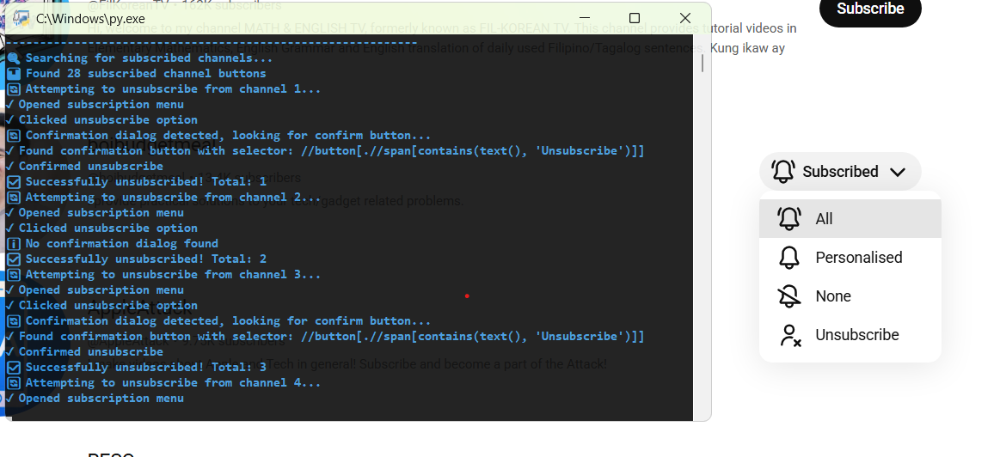

# YouTube Unsubscribe Automation

A powerful Python automation tool that helps you mass unsubscribe from YouTube channels quickly and efficiently.




## 🚀 Features

- **Mass Unsubscription**: Automatically unsubscribe from multiple YouTube channels at once
- **Smart Detection**: Uses precise XPath targeting to find subscribed channels
- **Confirmation Handling**: Automatically handles confirmation dialogs
- **Infinite Mode**: Runs continuously until manually stopped
- **Safe & Secure**: No credentials stored - manual login required
- **Stealth Mode**: Uses anti-detection techniques to avoid bot detection

## 🛠 How It Works

### Step 1: Setup & Login
1. **Launch the Application**
   - Run the Python script
   - Browser automatically opens to YouTube

2. **Manual Login**
   - Login to your YouTube account normally
   - Take your time - no interruptions
   - Press Enter in terminal when logged in

### Step 2: Automated Unsubscription Process

#### 🔍 Channel Detection
```python
# Smart XPath targeting for subscribed buttons
xpath_targets = [
    "//ytd-subscription-notification-toggle-button-renderer//button",
    "//button[@aria-label*='subscription']",
    "//button[contains(@class, 'subscription')]",
    "//button[.//span[contains(text(), 'Subscribed')]]"
]
